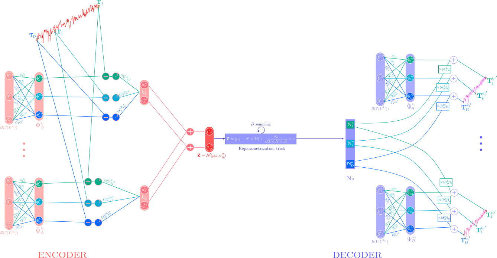

# From linear regression to generative model for explainable non profiled side-channel attacks

<a id="readme-top"></a>

This Git repository is associated with the article *From linear regression to generative model for explainable non profiled side-channel attacks* available on [Cryptology ePrint Archive](https://eprint.iacr.org/2026/274).

<!-- Table of contents -->
<details>
  <summary>Table of contents</summary>
  <ol>
    <li>
      <a href="#content-of-the-repository">Content of the repository</a>
      <ul>
        <li><a href="#context">Context</a></li>
        <li><a href="#implementation-tricks">Implementation tricks</a></li>
        <li><a href="#repository-structure">Repository structure</a></li>
      </ul>
    </li>
    <li>
      <a href="#getting-started">Getting Started</a>
      <ul>
        <li><a href="#prerequisites">Prerequisites</a></li>
        <li><a href="#installation">Installation</a></li>
      </ul>
    </li>
    <li><a href="#citation">Citation</a></li>
    <li><a href="#references">References</a></li>
  </ol>
</details>

## Content of the repository

### Context
We provide in this repository NPcVAE-OSM implementation and notebooks allowing to re-execute simulations and attacks conducted in our article. 

It should be noted for *Non profiled attack.ipynb* notebook that the attack scenario is conducted only for simulated traces because we do not provided in this repository the datasets we attacked for environmental reasons, as they are publicly available. 

They can be downloaded here:

- **DPA contest v4.2**: https://dpacontest.telecom-paris.fr/v2 
- **AES_HD_Ext**: https://github.com/AISyLab/AES_HD_Ext 
- **ASCAD v1-F**: https://github.com/ANSSI-FR/ASCAD/blob/master/ATMEGA_AES_v1/ATM_AES_v1_fixed_key
- **ASCAD v1-R**: https://github.com/ANSSI-FR/ASCAD/blob/master/ATMEGA_AES_v1/ATM_AES_v1_variable_key

Moreover, we draw users' attention to the fact that, to ensure proper attack execution, lines 138, 140, 262 and 264 in *non_profiled_attack.py* file must also be adapted to the targeted dataset.

We developed our model in Python 3.11.8, using Tensorflow [AAB+15] and Keras [C+15] libraries. 

### Implementation tricks (extract of paragraph *Implementation tricks* in Section 6.1 of our paper)
As in [BCG+25], we point out that when implementing our model, some implementation tricks are considered.
First, a particular attention on variances weights is required regarding their initialization and updating in order to ensure a proper model working.
Indeed, we initially set them to 1 and add a custom constraint during their updating that forces these weights to be always positive. 
Regarding layers estimating $\hat{\Psi}_\phi(Y^k)$ and $\hat{\Psi}_\theta(Y^k)$ for each key hypothesis $k\in\mathcal{K}$, we implement these dense layers such as biases are removed since biases term are already included in Walsh-Hadamard basis decomposition of sensitive values.
Moreover, as $(\mu_\phi)^k$ and $(\sigma^2_\phi)^k$ must converge respectively towards $D$ and $2D$ (see Section 3.2 and Equation 6 in our paper), we only estimate weights related to $(\mu_\phi)^k$ and then, use those estimations to compute $(\sigma^2_\phi)^k$ instead of re-estimating $(\sigma^2_\phi)^k$ weights.
This allows to reduce the number of trainable parameters by $D$ (with $D$ being  traces dimension) for each key hypothesis $k$.
Similarly, following Theorem 3 in our paper, we estimate weights related to $(\mu_\phi)^{k_0}$ for the first key hypothesis $k_0$ namely $(\hat{\sigma}^2_\phi)^{k_0}_i$ and then re-use those estimated weights for all other key hypotheses.
Indeed all $(\hat{\sigma}^2_\phi)^{k}_i$ converge for all samples towards the true variance $\sigma^2_i$ of the input trace $\mathbf{T}$, regardless of the key hypothesis considered.
This allows us therefore to reach complexity presented in Proposition 1 of our paper.
Finally, for convenience, we scaled the reconstruction loss term by a factor $\frac{1}{|\mathcal{K}|}$ (see Proposition 2 of our paper) \ie instead of summing over $k\in\mathcal{K}$, we consider the empirical mean over $k$.
Note that adding this multiplicative constant does not invalidate variational lower bound on the conditional marginal likelihood in  Theorem 2 in our paper.
To ensure proper weights convergence for all key hypotheses, we apply gradients locally in our model.
In other words, for a given key hypothesis $k$, gradients are computed considering the sum of the KL-divergence loss term and the corresponding reconstruction sub-loss (\ie $\mathbb{E}_{\mathbf{z}\sim E_\phi}\big[\log\big(\mathbb{P}(\mathbf{T}|Y^k,\mathbf{z},\theta)\big)\big]$, see Proposition 2 in our paper).
Then, these gradients are applied on a graph sub-portion that involves weights related to $k$.

<a id="npcvaeosm-picture"></a>
<p align="center">
  <a href=""></a>
</p>
<p align="center">NPcVAE-OSM architecture.</p>

### Repository structure

Our repository has the following structure:
```bash
.
|   Non profiled attack.ipynb
|   NPcVAE_OSM_picture.svg
|   requirements.txt
|
└── NPcVAE_OSM_utils
        non_profiled_attack.py
        NPcVAE_OSM_model.py
        NPcVAE_OSM_tools.py
        generate_traces.py 
        Kernel_Weights_Constraints.py
        __init__.py       
```
This repository contains 1 notebook, 1 file, a picture and a package which includes 6 modules.

In the following, we briefly summarize the contents of each file.

As previously explained, these notebook allow users to re-execute attacks conducted in Section 6.
- *Non profiled attack.ipynb* is a notebook in which we carry out non profiled attacks using NPcVAE-OSM and following stategy provided in Section 5.2.
- *NPcVAE_OSM_picture.svg* is a <a href="#npcvaeosm-picture">picture of NPcVAE-OSM architecture</a>.
- *requirements.txt* files is described in Section <a href="#getting-started">Getting started</a>.

In addition, we provide a package called $`\texttt{NPcVAE\_OSM\_utils}`$ that contains modules necessary for notebook running.

- *non_profiled_attack.py* implements the non profiled attack strategy introduced in Section 5.2.
- *NPcVAE_OSM_model.py* implements NPcVAE-OSM model.
- *NPcVAE_OSM_tools.py* includes all auxiliary functions that can be useful when using NPcVAE-OSM such as weights visualization function or projection onto the Guilley *et al.* orthonormal basis [GHMR17] that is used in the paper. 
- *generate_traces.py* implements a trace generation function, used to conduct our simulations.
- *Kernel_Weights_Constraints.py* implements custom weights constraint explained in <a href="#implementation-tricks">Implementation tricks</a> section.
- *\_\_init\_\_.py* empty file required to create our $`\texttt{cvae\_osm\_utils}`$ package.

<p align="right">(<a href="#readme-top">back to top</a>)</p>

## Getting started


### Prerequisites

To enforce experiment reproducibility, we provide a `requirements.txt` file to reproduce the Python environment used to perform experiments with `pip install`.

In case this solution is not suited (impossibility of using a virtual environment) we alternatively provide a list of dependencies with no version information.
In this later case there is a high probability of not being able to reproduce the same results and/or being forced to adapt part of the code.


### Installation

#### Using `requirements.txt`

First you need to create a new virtual environment with the classical `python` command:

    python -m venv .venv

Then activate the environment and install the dependencies:

    source .venv/bin/activate
    pip install -r requirements.txt

#### Using Dependency List

The packages required for running the notebook are:
  - tensorflow,
  - scipy,
  - numpy,
  - scikit-learn,
  - matplotlib,
  - ipykernel.

If none of the previous method is suited to your particular situation you can try to install these packages by the method of your choice and run the scripts.

For convenience, we provide the pip command below.

    pip install tensorflow scipy numpy scikit-learn matplotlib ipykernel

> Warning! The reproducibility of the results is then not guaranteed.

<p align="right">(<a href="#readme-top">back to top</a>)</p>

## Citation

If you use our code, model or wish to refer to our results, please use the following BibTex entry:
```
@misc{cryptoeprint:2026/274,
      author = {Sana Boussam and Mathieu Carbone and Benoît Gérard and Guénaël Renault and Gabriel Zaid},
      title = {From linear regression to generative model for explainable non profiled side-channel attacks},
      howpublished = {Cryptology {ePrint} Archive, Paper 2026/274},
      year = {2026},
      url = {https://eprint.iacr.org/2026/274}
}
```

<p align="right">(<a href="#readme-top">back to top</a>)</p>

## References

[AAB+15] Martín Abadi, Ashish Agarwal, Paul Barham, Eugene Brevdo, Zhifeng Chen, Craig Citro, Greg S. Corrado, Andy Davis, Jeffrey Dean, Matthieu Devin, Sanjay Ghemawat, Ian Goodfellow, Andrew Harp, Geoffrey Irving, Michael Isard, Yangqing Jia, Rafal Jozefowicz, Lukasz Kaiser, Manjunath Kudlur, Josh Levenberg, Dandelion Mané, Rajat Monga, Sherry Moore, Derek Murray, Chris Olah, Mike Schuster, Jonathon Shlens, Benoit Steiner, Ilya Sutskever, Kunal Talwar, Paul Tucker, Vincent Vanhoucke, Vijay Vasudevan, Fernanda Viégas, Oriol Vinyals, Pete Warden, Martin Wattenberg, Martin Wicke, Yuan Yu, and Xiaoqiang Zheng. TensorFlow: Large-scale machine learning on heterogeneous systems, 2015. Software available from tensorflow.org.

[BCG+25] Sana Boussam, Mathieu Carbone, Benoît Gérard, Guénaël Renault, and Gabriel Zaid. Optimal dimensionality reduction using conditional variational autoencoder. IACR Transactions on Cryptographic Hardware and Embedded Systems, 2025(3):164–211, Jun. 2025.

[C+15] François Chollet et al. Keras. https://keras.io, 2015.

[GHMR17]  Sylvain Guilley, Annelie Heuser, Tang Ming, and Olivier Rioul. Stochastic side-channel leakage analysis via orthonormal decomposition. In Innovative Security Solutions for Information Technology and Communications: 10th International Conference, SecITC 2017, Bucharest, Romania, June 8–9, 2017, Revised Selected Papers 10, pages 12–27. Springer, 2017.

<p align="right">(<a href="#readme-top">back to top</a>)</p>

